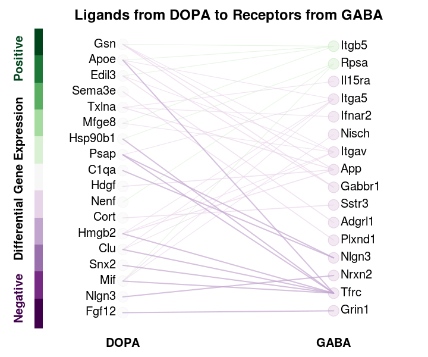
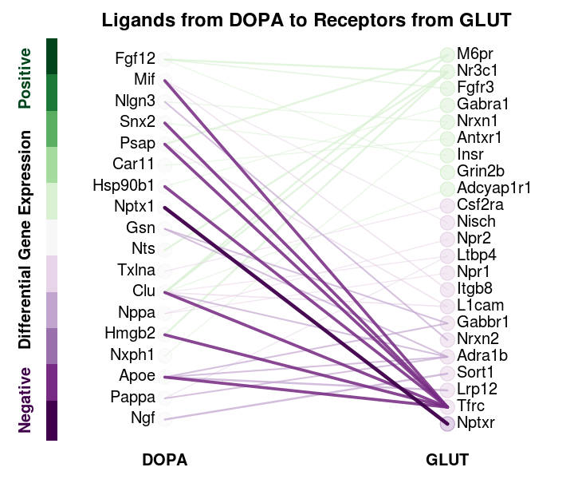
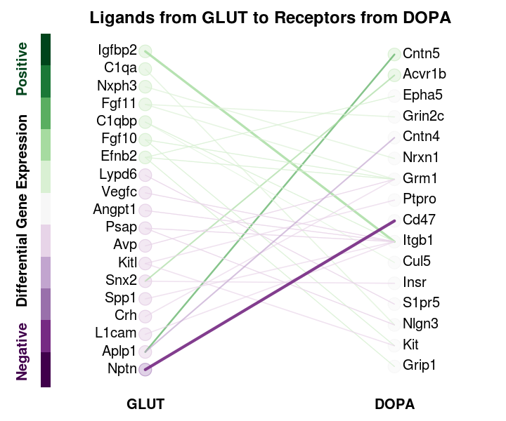

```{r setup_vignette, include = FALSE}
knitr::opts_chunk$set(
  collapse = TRUE,
  comment = "#>",
  fig.show = "hold"
)
```


```{r Generate Demo Data, eval=FALSE, include=FALSE}
# Setup ----
library(CCInx)
sysDr <- switch(Sys.info()["sysname"],"~/",Windows="D:/")
netDir <- paste0(sysDr,"Dropbox/GDB/CCCnetResources/1705_RuthData/")
inputDataPath <- paste0(sysDr,"Dropbox/GDB/RubinBrainEndo/Rubin_Data_for_Bader_Lab/190221/young_to_old_neuronal/")
# Load DE results -----------------------
deL <- sapply(list.files(inputDataPath)[2:4],function(X)
  read.csv(paste0(inputDataPath,X),as.is=T),simplify=F)
names(deL) <- sub(".csv$","",names(deL))
for (l in names(deL)) {
  deL[[l]] <- deL[[l]][!apply(deL[[l]],1,function(X) all(is.na(X) | X == "")),]
  rownames(deL[[l]]) <- deL[[l]]$Gene
  deL[[l]] <- deL[[l]][,-which(colnames(deL[[l]]) == "Gene")]
  deL[[l]] <- deL[[l]][order(deL[[l]]$padj),]
  deL[[l]] <- deL[[l]][1:2000,c("pval","padj","logFC_Young_to_Old","Percent_Pos_Cells_Young","Percent_Pos_Cells_Old")]
  names(deL[[l]])[3:5] <- c("logFC","DetectPctYoung","DetectPctOld")
  deL[[l]] <- deL[[l]][!is.na(deL[[l]]$logFC),]
}
save(deL,file="../inst/DemoData/DemoDE.RData")
```

# CCInx Usage
CCInx takes cell type transcriptomes (generally from clustered scRNAseq data) and predicts cell-cell interaction networks. It generates both node and edgelists appropriate for importing into graph visualization software such as Cytoscape, and figures showing bipartite graphs for predicted interactions between pairs of cell types.

Here we'll demonstrate the standard use case using data from [a recent study of aging mouse brain](https://www.biorxiv.org/content/10.1101/440032v1), where differential expression testing was performed between young and aging neuronal cell types.  The input data is a list of data frames, where each named list entry represents a cell type, and its data frame contains the differential expression statistics for genes in that cell type.

```{r Demo data}
library(CCInx)
load(system.file("DemoData/DemoDE.RData",package="CCInx"))
lapply(deL,head)
```

CCInx is run as follows.  First, the nodes are scored in order to rank and filter them for inclusion in the network. Scores are scaled for ease of comparison between cell types, and converted for factors for plot colour scale.

```{r Score nodes,fig.}
scoredGeneList <- ScoreClustGenes(GeneStatList=deL,
                                  GeneMagnitude="logFC",
                                  GeneStatistic="padj")

par(mar=c(3,3,1,1),mgp=2:0)
hist(scoredGeneList$GABA$score,breaks=100,xlab="Node DE score",main=NA)
hist(scoredGeneList$GABA$scaledFactor,xlab="Node score as scaled factor",main=NA)
```

The network is then built using the list of scored DE gene data frames. The output of `BuildInx` is a list of dataframes serving as edge list for each pair of cell types, and `BuildInxNode` generates the corresponding node metadata. These can be exported as .csv files for use in Cytoscape.

```{r Build CCInx}
inx <- BuildInx(SCL=scoredGeneList,
                NodeScoreThreshold=0,
                EdgeScoreThreshold=0,
                species="mmusculus")

head(inx$`DOPA~GABA`)

inxNode <- BuildInxNode(INX=inx,
                        SCL=scoredGeneList)

head(inxNode$`DOPA~GABA`)
```


```{r Plot CCInx, eval=FALSE, include=TRUE}
PlotCCInx(INX=inx,
          INXNODE=inxNode,
          comparisons=c("DOPA~GABA","DOPA~GLUT"),
          directions=c("LtoR","RtoL"),
          topPer=20,
          imageFileType="png",
          imageFilePath="../inst/DemoData/")
```




